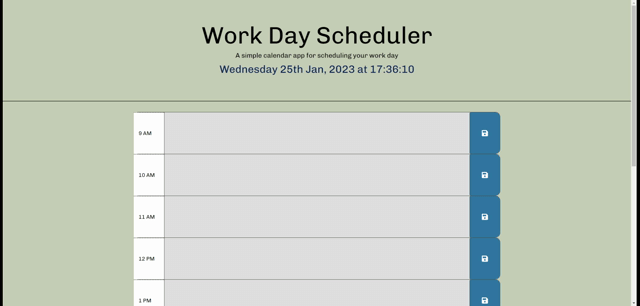

# Third-Party APIs: Daily Planner Schedule

A simple calendar application that allows a user to save events for each hour of the day. This app will run in the browser and feature dynamically updated HTML and CSS powered by jQuery and Moment.js.

## Application features:

* Users can organise their daily work hour activities.

* Display the current day at the top of the calender when a user opens the planner.
 
* Present timeblocks for standard business hours when the user scrolls down.
 
* Color-code each timeblock based on past, present, and future when the timeblock is viewed.
 
* Allow a user to enter an event when they click a timeblock

* Save the event in local storage when the save button is clicked in that timeblock.

* Persist events between refreshes of a page

## The application functionality:

## Link to deployed application 
 
https://soradaw.github.io/Daily-Planner-App/

---
© 2023 || Sorada Wright || All Rights Reserved.
